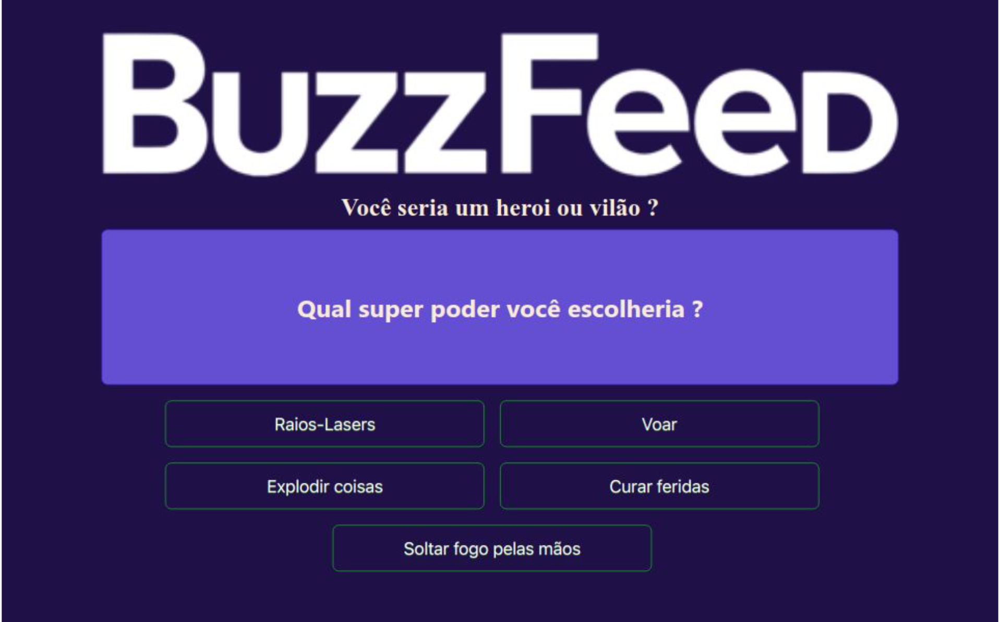

## BuzzFeed: Descubra se você seria um super-heroi ou vilão!

**Preview:**

**Um teste divertido para descobrir se você tem o que é preciso para ser um super-herói!**

Este projeto Angular simula um quiz do BuzzFeed, onde o usuário responde a perguntas e descobre qual super-herói ele seria.

**Funcionalidades:**

* **Quiz Interativo:** Perguntas dinâmicas e respostas variadas.
* **Resultados Personalizados:** Feedbacks únicos para cada perfil de herói.
* **Banco de Dados Simulado:** Utiliza um JSON para armazenar as perguntas, respostas e resultados.

**Tecnologias:**

* Angular
* TypeScript
* JSON

**Como Usar:**
1. Clone este repositório.
2. Instale as dependências: `npm install`.
3. Execute o projeto: `ng serve` para a url `http://localhost:4200/`.
4. Acesse http://localhost:4200 no seu navegador.
